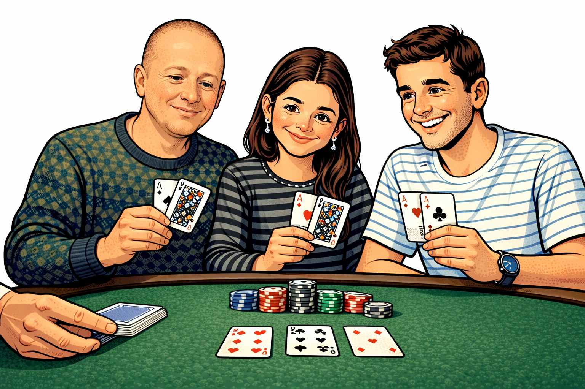

<div align="center">

# 🎰 BLACKJACK - Network Edition 🎰

### ♠️ ♥️ ♣️ ♦️ Intro to Networks Hackathon 2025 ♦️ ♣️ ♥️ ♠️


```
    ┌─────────┐  ┌─────────┐  ┌─────────┐  ┌─────────┐
    │ A       │  │ K       │  │ Q       │  │ J       │
    │         │  │         │  │         │  │         │
    │    ♠    │  │    ♥    │  │    ♦    │  │    ♣    │
    │         │  │         │  │         │  │         │
    │       A │  │       K │  │       Q │  │       J │
    └─────────┘  └─────────┘  └─────────┘  └─────────┘
```

### **A multiplayer Blackjack game using TCP/UDP networking protocols**

[Features](#-features) •
[Installation](#-installation) •
[Usage](#-usage) •
[Protocol](#-protocol) •
[Statistics](#-statistics) •
[Bonus Modes](#-bonus-game-modes) •
[Team](#-team)

---

<p align="center">
  
</p>

---

</div>

## 📖 About

This project implements a **client-server Blackjack game** as part of the Introduction to Networks course hackathon. The server acts as the dealer, broadcasting its presence via UDP, while clients connect via TCP to play rounds of Blackjack.

### 🎯 Project Goals
- Implement reliable **TCP communication** for gameplay
- Use **UDP broadcasting** for server discovery
- Create a **compatible protocol** that works with any client/server
- Build a **fun, interactive** terminal-based game

---

## ✨ Features

### 🎮 Gameplay
- ✅ Classic Blackjack rules
- ✅ Multiple rounds support (1-255)
- ✅ Hit / Stand decisions
- ✅ Automatic dealer AI (hits until 17+)
- ✅ Bust detection
- ✅ Win/Lose/Tie outcomes

### 🖥️ User Interface
- 🎨 Colorful terminal output with ANSI colors
- 🃏 Beautiful ASCII art card display
- 📊 Comprehensive statistics tracking
- 🏆 Win rate calculation
- 🎰 Beautiful welcome screen

### 🌐 Networking
- 📡 UDP broadcast for server discovery
- 🔌 TCP connection for reliable gameplay
- 🔄 Multi-client support (threaded server)
- ⏱️ Timeout handling
- 🛡️ Error recovery

### 🎯 Server Selection
- 🔍 Automatic server scanning
- 📋 List of available servers
- 🎯 Choose which server to join
- 🔄 Rescan option

---

## 📁 Project Structure
```
blackjack/
├── 📄 constants.py      # Protocol constants & configuration
├── 📄 protocol.py       # Packet creation & parsing
├── 📄 game_logic.py     # Card, Deck & game rules
├── 📄 server.py         # Blackjack dealer server
├── 📄 client.py         # Player client application
├── 📄 display.py        # Visual output functions
├── 📁 assets/           
│   └── 🖼️ pic.png
└── 📄 README.md         
```

---

## 🚀 Installation

### Prerequisites
- Python 3.x
- No external dependencies! (uses only standard library)

### Clone & Run
```bash
git clone https://github.com/gayagur/blackjack-hackathon.git
cd blackjack-hackathon
```

---

## 🎮 Usage

### Start the Server (Dealer)
```bash
python server.py
```
```
============================================================
Blackjack Server Started
============================================================
Server started, listening on IP address 192.168.1.10
TCP port: 54321
Team name: GayaMatias
============================================================

[UDP] Broadcasting offers on port 13122...
```

### Start the Client (Player)
```bash
python client.py
```
```
╔════════════════════════════════════════════════════════════╗
║        ♠ ♥ ♣ ♦   B L A C K J A C K   ♦ ♣ ♥ ♠              ║
║           🎰  WELCOME TO THE CASINO  🎰                    ║
╚════════════════════════════════════════════════════════════╝

How many rounds do you want to play? 5

[🔍] Scanning for servers...
  Found: GayaMatias at 192.168.1.10

==================================================
Available servers:
==================================================
  1. GayaMatias (192.168.1.10:54321)
  0. Rescan
==================================================

Choose server (0 to rescan): 1
```

### Gameplay Example
```
    ╔════════════════════════════════════════════════════════════╗
    ║                        D E A L E R                         ║
    ╚════════════════════════════════════════════════════════════╝
    ┌─────────┐  ┌─────────┐
    │ K       │  │░░░░░░░░░│
    │         │  │░░░░░░░░░│
    │    ♠    │  │░░░░░░░░░│
    │         │  │░░░░░░░░░│
    │       K │  │░░░░░░░░░│
    └─────────┘  └─────────┘

    Value: 10 + ?

    ╔════════════════════════════════════════════════════════════╗
    ║                      Y O U R   H A N D                     ║
    ╚════════════════════════════════════════════════════════════╝
    ┌─────────┐  ┌─────────┐
    │ 7       │  │ 9       │
    │         │  │         │
    │    ♥    │  │    ♣    │
    │         │  │         │
    │       7 │  │       9 │
    └─────────┘  └─────────┘

    Value: 16

    Hit or Stand? (h/s): _
```

---

## 📡 Protocol

### Message Types

| Type | Code | Direction | Description |
|------|------|-----------|-------------|
| **Offer** | `0x02` | Server → Client | UDP broadcast announcing server |
| **Request** | `0x03` | Client → Server | TCP request to join game |
| **Payload** | `0x04` | Both | Game data (cards/decisions) |

### Packet Formats

#### 🔵 Offer Packet (39 bytes)
```
┌──────────────┬──────────────┬──────────────┬──────────────┐
│ Magic Cookie │ Message Type │   TCP Port   │ Server Name  │
│   4 bytes    │    1 byte    │   2 bytes    │   32 bytes   │
│  0xabcddcba  │     0x02     │              │  (padded)    │
└──────────────┴──────────────┴──────────────┴──────────────┘
```

#### 🟢 Request Packet (38 bytes)
```
┌──────────────┬──────────────┬──────────────┬──────────────┐
│ Magic Cookie │ Message Type │  Num Rounds  │ Client Name  │
│   4 bytes    │    1 byte    │    1 byte    │   32 bytes   │
│  0xabcddcba  │     0x03     │    1-255     │  (padded)    │
└──────────────┴──────────────┴──────────────┴──────────────┘
```

#### 🟡 Payload - Client (10 bytes)
```
┌──────────────┬──────────────┬──────────────┐
│ Magic Cookie │ Message Type │   Decision   │
│   4 bytes    │    1 byte    │   5 bytes    │
│  0xabcddcba  │     0x04     │ Hittt/Stand  │
└──────────────┴──────────────┴──────────────┘
```

#### 🟠 Payload - Server (9 bytes)
```
┌──────────────┬──────────────┬────────┬───────────┬───────────┐
│ Magic Cookie │ Message Type │ Result │ Card Rank │ Card Suit │
│   4 bytes    │    1 byte    │ 1 byte │  2 bytes  │  1 byte   │
│  0xabcddcba  │     0x04     │  0-3   │   1-13    │   0-3     │
└──────────────┴──────────────┴────────┴───────────┴───────────┘
```

---

## 🃏 Game Rules

<div align="center">

| Card | Value |
|:----:|:-----:|
| 2-10 | Face Value |
| J, Q, K | 10 |
| A | 11 |

</div>

### Game Flow
```
1️⃣  Server deals 2 cards to player (visible)
2️⃣  Server deals 2 cards to dealer (1 hidden)
3️⃣  Player chooses: Hit (draw) or Stand (stop)
4️⃣  If player > 21 → BUST → Player loses
5️⃣  Dealer reveals hidden card
6️⃣  Dealer draws until >= 17
7️⃣  If dealer > 21 → BUST → Player wins
8️⃣  Compare totals → Higher wins!
```

---

## 📊 Statistics

The game tracks comprehensive statistics throughout your session:
```
╔════════════════════════════════════════════════════════════════╗
║                    📊 GAME STATISTICS 📊                       ║
╠════════════════════════════════════════════════════════════════╣
║                                                                ║
║   ┌─────────────────── RESULTS ───────────────────┐            ║
║   │   🎮 Rounds Played:     10                    │            ║
║   │   ✅ Wins:              6                     │            ║
║   │   ❌ Losses:            3                     │            ║
║   │   🤝 Ties:              1                     │            ║
║   │   📈 Win Rate:          60.0%                 │            ║
║   └───────────────────────────────────────────────┘            ║
║                                                                ║
║   ┌─────────────────── STREAKS ───────────────────┐            ║
║   │   🔥 Best Win Streak:   4                     │            ║
║   │   💀 Worst Lose Streak: 2                     │            ║
║   └───────────────────────────────────────────────┘            ║
║                                                                ║
║   ┌─────────────────── HIGHLIGHTS ────────────────┐            ║
║   │   🎰 Blackjacks:        2                     │            ║
║   │   💥 Busts:             3                     │            ║
║   │   💀 Dealer Busts:      4                     │            ║
║   │   📊 Avg Hand Value:    17.5                  │            ║
║   └───────────────────────────────────────────────┘            ║
║                                                                ║
╚════════════════════════════════════════════════════════════════╝
```

---

## 🎁 Bonus Game Modes

In addition to the classic mode, we implemented **two bonus modes** for extra fun:

### 🎰 Casino Mode
A full betting experience with chips!

- 💰 Start with **$1,000** chips
- 🎲 Place bets **$10 - $500** per round
- ⬆️ **Double Down** - double your bet for one card
- 🎰 **Blackjack pays 1.5x**
- 💸 Go broke = Game Over!

### 🤖 Bot Mode
Watch AI play with mathematically optimal strategy!

- 🧠 Uses **Basic Strategy** (optimal decisions)
- 📈 Auto-plays rounds automatically
- 📊 Compare performance vs expected win rate
- 🎓 Learn perfect Blackjack strategy

---

## 🛠️ Technical Details

### Technologies
- **Python 3.x** - Programming language
- **socket** - Network communication
- **threading** - Concurrent client handling
- **struct** - Binary packet encoding/decoding

### Network Architecture
<p align="center">
  
</p>


---

## 👥 Team

<div align="center">

### 🃏 The Developers 🃏

|  |  |
|:---:|:---:|
| **Gaya Gur** | **Matias Guernik** |
| [](https://github.com/gayagur) | [](https://github.com/matiasg5) |

</div>

---

## 📝 License

This project was created for educational purposes as part of the **Introduction to Networks** course at **Ben-Gurion University of the Negev**.

---

<div align="center">

## 🎰 Good Luck at the Tables! 🎰
```
     ___________
    |     |     |
    |  ♠  |  ♥  |
    |_____|_____|
    |     |     |
    |  ♣  |  ♦  |
    |_____|_____|
```

### **May your hand always be 21!** 🃏

Made with ❤️ by **Gaya & Matias**

</div>
