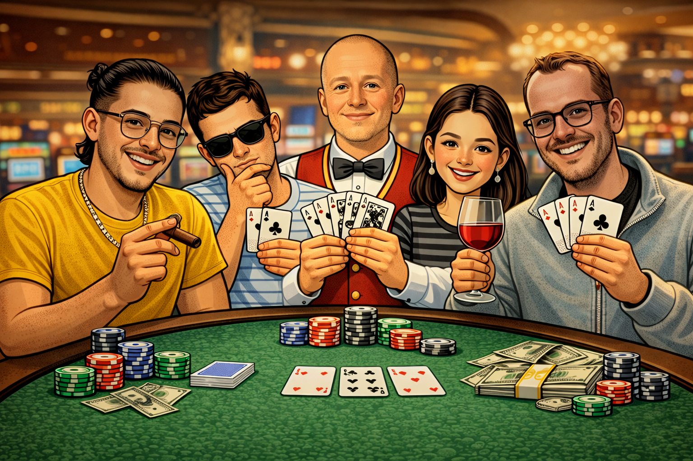
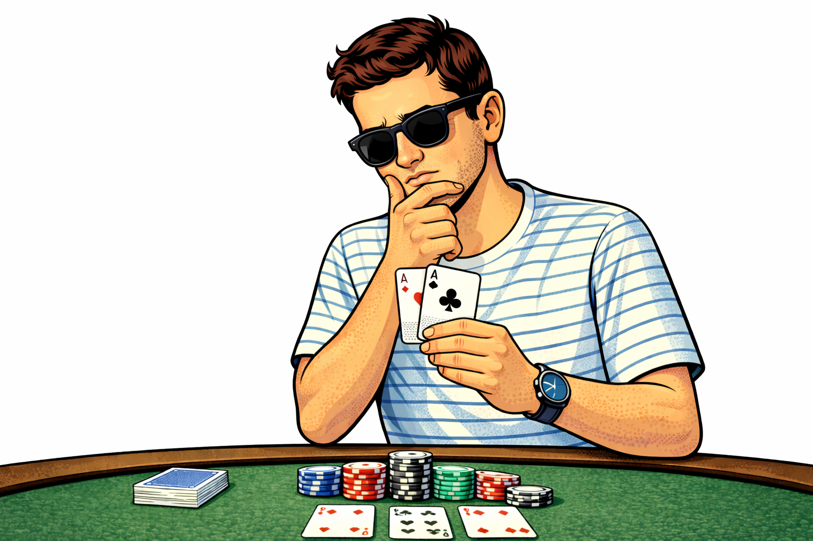
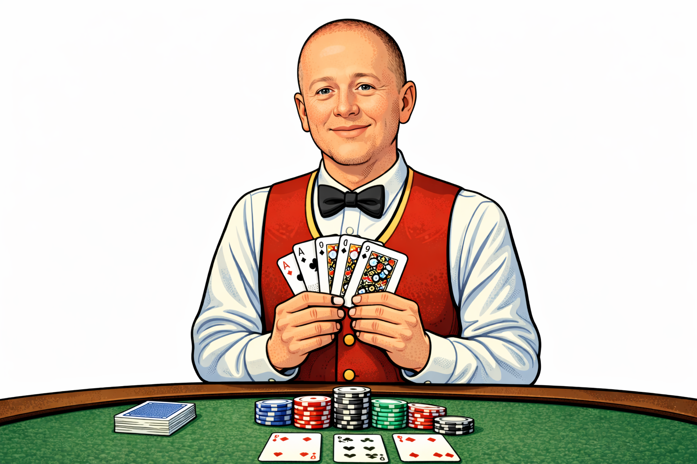
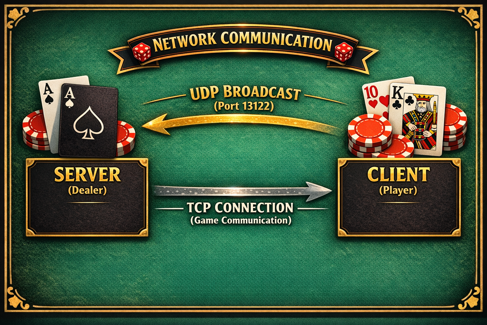

<div align="center">

# 🎰 BLACKJACK - Web Edition 🎰

### ♠️ ♥️ ♣️ ♦️ Intro to Networks Hackathon 2025 ♦️ ♣️ ♥️ ♠️


```
    ┌─────────┐  ┌─────────┐  ┌─────────┐  ┌─────────┐
    │ A       │  │ K       │  │ Q       │  │ J       │
    │         │  │         │  │         │  │         │
    │    ♠    │  │    ♥    │  │    ♦    │  │    ♣    │
    │         │  │         │  │         │  │         │
    │       A │  │       K │  │       Q │  │       J │
    └─────────┘  └─────────┘  └─────────┘  └─────────┘
```

### **A professional Blackjack web application with beautiful UI and multiple game modes**

[Features](#-features) •
[Game Modes](#-game-modes) •
[Characters](#-choose-your-character) •
[Installation](#-installation) •
[Usage](#-usage) •
[Statistics](#-statistics) •
[Team](#-team)

---

<p align="center">
  
</p>

---

</div>

## 📖 About

This project implements a **professional web-based Blackjack game** as part of the Introduction to Networks course hackathon. The web client connects to our Python TCP/UDP game server, providing a beautiful visual interface for playing Blackjack.

### 🎯 Project Goals
- Create a **stunning web interface** for Blackjack
- Implement **real-time communication** using WebSockets
- Bridge **Flask web server** with TCP/UDP game protocol
- Provide **multiple game modes** for different play styles
- Track comprehensive **game statistics**

---

## ✨ Features

### 🎮 Gameplay
- ✅ Classic Blackjack rules
- ✅ Multiple rounds support (1-255)
- ✅ Hit / Stand / Double Down decisions
- ✅ Automatic dealer AI (hits until 17+)
- ✅ Blackjack detection with 1.5x payout
- ✅ Bust detection and animations

### 🖥️ Web Interface
- 🎨 Beautiful modern dark theme design
- 🃏 Animated card dealing and flipping
- ✨ Smooth transitions and effects
- 📱 Responsive design for all devices
- 🎭 Character selection with avatars
- 🏆 Real-time score display

### 🌐 Networking
- 📡 UDP broadcast for server discovery
- 🔌 TCP connection for reliable gameplay
- 🔄 WebSocket bridge (Flask-SocketIO)
- ⏱️ Automatic reconnection handling
- 🛡️ Error recovery and display

### 📊 Statistics System
- 📈 Win/Loss/Tie tracking
- 🔥 Win and lose streaks
- 🎰 Blackjack counter
- 💥 Bust tracking
- 💰 Chip balance history (Casino Mode)
- 🤖 Bot performance analysis (Bot Mode)

---

## 🎮 Game Modes

<div align="center">

| Mode | Icon | Description |
|:----:|:----:|:------------|
| **Classic** | 🎮 | Simple Blackjack - Hit or Stand |
| **Casino** | 🎰 | Full betting system with chips |
| **Bot** | 🤖 | Watch AI play with optimal strategy |

</div>

### 🎮 Classic Mode
The traditional Blackjack experience:
- Simple Hit or Stand decisions
- Play multiple rounds
- Track your win rate

### 🎰 Casino Mode
A full casino betting experience:
- 💰 Start with **$1,000** chips
- 🎲 Place bets **$10 - $500** per round
- ⬆️ **Double Down** - double your bet for one more card
- 🎰 **Blackjack pays 1.5x** your bet
- 💸 Beautiful chip visualization
- 📊 Track profits and ROI

### 🤖 Bot Mode
Watch the AI play perfect strategy:
- 🧠 Uses **Basic Strategy** (mathematically optimal)
- 📈 Automatic decision making
- 📊 Compare performance vs expected ~42.5% win rate
- 🎓 Learn optimal Blackjack strategy by watching

---

## 👥 Choose Your Character

Pick your avatar before entering the casino!

<div align="center">

### 🎭 Players

| | | | |
|:---:|:---:|:---:|:---:|
|  |  |  |  |
| **Gaya** | **Matias** | **Naveh** | **Nadav** |

### 🎩 Dealer

| |
|:---:|
|  |
| **Yossi** |
| *The House Always... Maybe Wins* |

</div>

---

## 📁 Project Structure

```
blackjack/
├── 📄 constants.py          # Protocol constants & configuration
├── 📄 protocol.py           # Packet creation & parsing
├── 📄 game_logic.py         # Card, Deck & game rules
├── 📄 server.py             # Blackjack dealer server (TCP/UDP)
├── 📄 client.py             # Terminal client application
├── 📄 display.py            # Terminal visual output
│
├── 📁 web/                  # 🌐 Web Application
│   ├── 📄 server.py         # Flask + SocketIO web server
│   ├── 📁 templates/
│   │   └── 📄 index.html    # Main web interface
│   └── 📁 static/
│       ├── 📄 style.css     # Styles and animations
│       └── 📄 script.js     # Client-side game logic
│
├── 📁 assests/              # 🖼️ Images
│   ├── 🖼️ pic.png           # Header image
│   ├── 🖼️ gaya.png          # Player avatar
│   ├── 🖼️ matias.png        # Player avatar
│   ├── 🖼️ naveh.png         # Player avatar
│   ├── 🖼️ nadav.png         # Player avatar
│   └── 🖼️ yossi.png         # Dealer avatar
│
└── 📄 README.md
```

---

## 🚀 Installation

### Prerequisites
- Python 3.x
- Flask
- Flask-SocketIO

### Install Dependencies
```bash
pip install flask flask-socketio
```

### Clone & Setup
```bash
git clone https://github.com/gayagur/blackjack-hackathon.git
cd blackjack-hackathon
```

---

## 🎮 Usage

### Step 1: Start the Game Server (Dealer)
```bash
python server.py
```
```
============================================================
Blackjack Server Started
============================================================
Server started, listening on IP address 192.168.1.10
TCP port: 54321
Team name: GayaMatias
============================================================

[UDP] Broadcasting offers on port 13122...
```

### Step 2: Start the Web Server
```bash
cd web
python server.py
```
```
======================================================================
🎰 BLACKJACK WEB CLIENT - Professional Edition
======================================================================
🌐 Server starting on http://127.0.0.1:5000
📱 Open your browser and navigate to the URL above
======================================================================
```

### Step 3: Open Your Browser
Navigate to **http://127.0.0.1:5000** and enjoy!

---

## 🎯 How to Play

<div align="center">

```
┌─────────────────────────────────────────────────────────────┐
│                      🎰 GAME FLOW 🎰                        │
├─────────────────────────────────────────────────────────────┤
│                                                             │
│   1️⃣  Click "START GAME"                                   │
│              ↓                                              │
│   2️⃣  Choose Game Mode (Classic/Casino/Bot)                │
│              ↓                                              │
│   3️⃣  Select Your Character                                │
│              ↓                                              │
│   4️⃣  Scan for Servers & Connect                           │
│              ↓                                              │
│   5️⃣  Play Blackjack!                                      │
│              ↓                                              │
│   6️⃣  View Statistics                                      │
│                                                             │
└─────────────────────────────────────────────────────────────┘
```

</div>

### 🃏 Game Rules

| Card | Value |
|:----:|:-----:|
| 2-10 | Face Value |
| J, Q, K | 10 |
| A | 11 (or 1 if bust) |

**Goal:** Get closer to 21 than the dealer without going over!

---

## 📊 Statistics

The web app tracks comprehensive statistics displayed in a beautiful modal:

<div align="center">

### 📈 All Modes
| Statistic | Description |
|-----------|-------------|
| Wins / Losses / Ties | Round results |
| Win Rate | Percentage of wins |
| Best Win Streak | Consecutive wins |
| Worst Lose Streak | Consecutive losses |
| Blackjacks | Natural 21s dealt |
| Busts | Times went over 21 |
| Dealer Busts | Times dealer went over |

### 💰 Casino Mode Exclusive
| Statistic | Description |
|-----------|-------------|
| Chip Balance | Current chips |
| Starting Chips | Initial $1,000 |
| Total Won | All winnings |
| Total Lost | All losses |
| Net Profit | Won - Lost |
| ROI | Return on investment % |
| Double Downs | Times doubled |

### 🤖 Bot Mode Exclusive
| Statistic | Description |
|-----------|-------------|
| Actual Win Rate | Bot's performance |
| Expected Rate | ~42.5% baseline |
| Bot Decisions | Total choices made |
| Cards Analysis | Aces, Face, High, Low |

</div>

---

## 🛠️ Technical Details

### Network Architecture

<p align="center">
  
</p>

### Technologies Used
- **Frontend:** HTML5, CSS3, JavaScript, Socket.IO
- **Backend:** Python, Flask, Flask-SocketIO
- **Networking:** TCP/UDP Sockets
- **Protocol:** Custom binary protocol

---

## 🎨 Screenshots

### Welcome Screen
- Beautiful animated logo
- Floating card showcase
- Glowing start button

### Game Screen
- Real-time card display
- Player and dealer sections
- Animated chip visualization (Casino Mode)
- Live score tracking

### Statistics Modal
- Comprehensive stats display
- Mode-specific sections
- Animated win rate bar
- Chip stack visualization

---

## 👥 Team

<div align="center">

### 🃏 The Developers 🃏

|  |  |
|:---:|:---:|
| **Gaya Gur** | **Matias Guernik** |
| [](https://github.com/gayagur) | [](https://github.com/matiasg5) |

</div>

---

## 📝 License

This project was created for educational purposes as part of the **Introduction to Networks** course at **Ben-Gurion University of the Negev**.

---

<div align="center">

## 🎰 Good Luck at the Tables! 🎰

```
     ___________
    |     |     |
    |  ♠  |  ♥  |
    |_____|_____|
    |     |     |
    |  ♣  |  ♦  |
    |_____|_____|
```

### **May your hand always be 21!** 🃏

Made with ❤️ by **Gaya & Matias**

</div>
